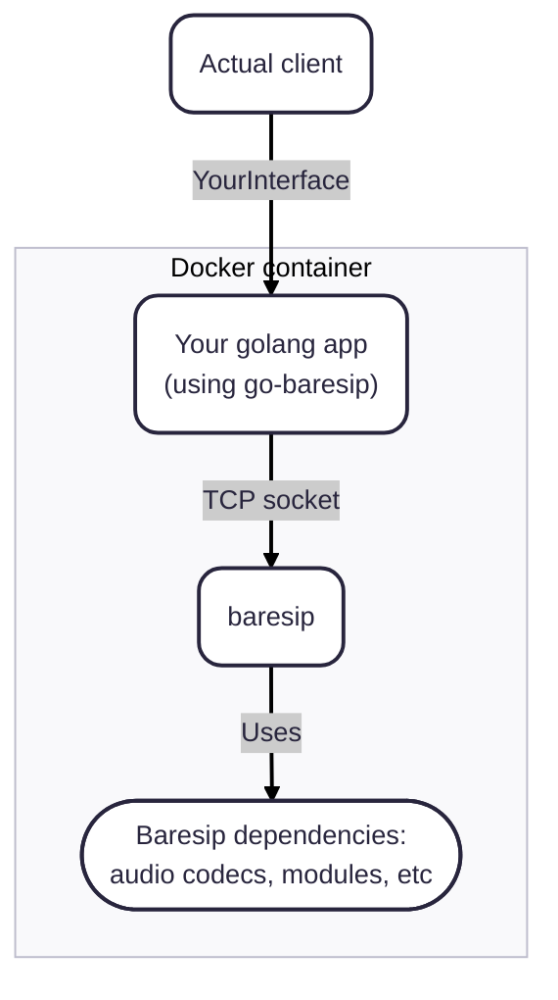

# go-baresip

This repository provides a tiny wrapper around [baresip](https://github.com/baresip/baresip)
in the form of a few Golang packages.
An example golang application using these packages is available as [example](./example/main.go).

## How it works

* allocating the `Baresip` struct, an instance of the `baresip` binary will be started in the background; such binary is not provided from this repository, see [baresip](https://github.com/baresip/baresip) for information on how to install it; the `baresip` instance will live as much time as the golang `Baresip` type;

* the `baresip` binary will process a number of configuration files like `~/.baresip/accounts`, `~/.baresip/config`, etc (see https://github.com/baresip/baresip/wiki/Configuration); such configuration files are not provided by this repository; however this repository will read the `ctrl_tcp_listen` parameter from `~/.baresip/config` to locate the TCP port for controlling baresip;

* the golang `Baresip` type will connect to the TCP port and will listen to `baresip` notifications (e.g. "incoming call", etc) and provides easy methods to send commands to the `baresip` binary

## Typical Application

Since `baresip` has many dependencies (mainly to support a wide variety of audio and video CODECs), several config files, and is not widely available as native package (e.g. RPM, Debian pkg), the intended usecase for this library
is to run your golang application within a Docker container containing also your custom build of the `baresip` binary with all required dynamic libraries and configuration files.

Of course the `Actual client` and the `golang app` are up to you to design to fit your needs.

## Original project

This repository was born as a fork from https://github.com/negbie/go-baresip, which is unmaintained.
A number of large refactors were done so the project now looks quite different compared to that
starting base.
